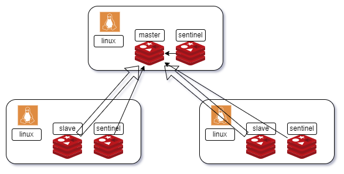

## 哨兵模式

## redis sentinel
```
make install PREFIX=/Users/hn/Macintosh/work/redis/sentienl/


# redis.conf
bind 0.0.0.0
protected-mode no
daemonize yes
requirepass chench

port 6379
pidfile ./redis_6379.pid
dbfilename redis_6379.rdb
#dir ./

appendonly yes
appendfilename redis_6379.aof
logfile ./redis_6379.log
#loglevel verbose

# master not replica only 
replicaof 127.0.0.1 6380
masterauth chench


# sentinel.conf
protected-mode no
port 16380
sentinel monitor mymaster 127.0.0.1 6380 2
sentinel auth-pass mymaster chench


root@localhost:sentinel# cat redis_conf.sh 

root@localhost:sentinel# cat sentinel_conf.sh 
```

## start.sh|bat
### 1.说明
1. 先启动一个主机服务进程
2. 再启动两个备机服务进程
3. 后启动三个哨兵服务进程


### 2.脚本
- 主备服务进程启动脚本：
	- `redis-server redis-port.conf`
- 哨兵服务进程启动脚本：
	`redis-sentinel redis-sentinel-port.conf`
	`redis-server redis-sentinel-port.conf --sentinel`


#### redis.conf
### 1.说明
```conf
# 通用配置
bind 0.0.0.0 # 地址

requirepass ****** # 密码

daemonize yes # 开启守护线程

protected-mode no # 禁用保护模式

# 集群配置
port 6379 # 端口

pidfile /var/run/redis-6379.pid # 进程文件

dbfilename dump-6379.rdb # 数据文件

logfile "/var/log/redis-6379.log"

# 主备配置（主机不需备机需要）
slaveof 127.0.0.1 6379 # 主机地址和端口

masterauth ****** # 主机密码
```

### 2.脚本
```bash
#!/bin/bash

# REDIS_PORT=6379
read -p 'REDIS_PORT:' REDIS_PORT
REDIS_PATH=$PWD
REDIS_CONF=$PWD/redis_$REDIS_PORT.conf

REQUIREPASS=chench
MASTERAUTH=chench

cp -f ./redis.conf $REDIS_CONF
sed 's/^bind 127.0.0.1.*/bind 0.0.0.0/' $REDIS_CONF -i
sed 's/^.*daemonize no.*/daemonize yes/' $REDIS_CONF -i
sed 's/^.*protected-mode yes.*/protected-mode no/' $REDIS_CONF -i
sed '$arequirepass '$REQUIREPASS'' $REDIS_CONF -i

sed 's/^port.*/port '$REDIS_PORT'/' $REDIS_CONF -i
sed 's#^.*pidfile.*#pidfile ./redis_'$REDIS_PORT'.pid #' $REDIS_CONF -i
sed 's#^.*dbfilename.*#dbfilename redis_'$REDIS_PORT'.rdb #' $REDIS_CONF -i

sed 's/^.*appendonly no.*/appendonly yes/' $REDIS_CONF -i
sed 's#^.*appendfilename.*#appendfilename redis_'$REDIS_PORT'.aof #' $REDIS_CONF -i
sed 's#^.*logfile.*#logfile ./redis_'$REDIS_PORT'.log #' $REDIS_CONF -i


read -p 'master or replica?(y/n):' Y_N
if [ $Y_N == 'y' ];then
    echo 'master'
else
    echo 'replica'
    read -p 'MASTER_HOST:' MASTER_HOST
    read -p 'MASTER_PORT:' MASTER_PORT
    sed '$aslaveof '$MASTER_HOST' '$MASTER_PORT'' $REDIS_CONF -i
    sed '$amasterauth '$MASTERAUTH'' $REDIS_CONF -i
fi

../bin/redis-server ./redis_$REDIS_PORT.conf
```

## sentinel.conf
### 1.说明
```conf
protected-mode no # 禁用保护模式

port 26379 # 端口

# sentinel monitor 哨兵监听
# mymaster 主机名称
# 127.0.0.1 主机地址
# 6379 主机端口
# 2 哨兵数量
sentinel monitor mymaster 127.0.0.1 6379 2

# 主机密码：mymaster 主机名称
sentinel auth-pass mymaster ******
```

### 2.脚本
```bash
#!/bin/bash

# SENTINEL_PORT=6379
read -p 'SENTINEL_PORT:' SENTINEL_PORT
SENTINEL_PATH=$PWD
SENTINEL_CONF=$PWD/sentinel_$SENTINEL_PORT.conf

REQUIREPASS=chench
MASTERAUTH=chench

cp -f ./sentinel.conf $SENTINEL_CONF
sed 's/^bind 127.0.0.1.*/bind 0.0.0.0/' $SENTINEL_CONF -i
sed 's/^.*daemonize no.*/daemonize yes/' $SENTINEL_CONF -i
sed 's/^.*protected-mode yes.*/protected-mode no/' $SENTINEL_CONF -i
sed '$arequirepass '$REQUIREPASS'' $SENTINEL_CONF -i

sed 's/^port.*/port '$SENTINEL_PORT'/' $SENTINEL_CONF -i
sed 's#^.*pidfile.*#pidfile ./redis_'$SENTINEL_PORT'.pid #' $SENTINEL_CONF -i
sed 's#^.*dbfilename.*#dbfilename redis_'$SENTINEL_PORT'.rdb #' $SENTINEL_CONF -i

sed 's/^.*daemonize no.*/daemonize yes/' $SENTINEL_CONF -i
sed 's#^.*appendfilename.*#appendfilename redis_'$SENTINEL_PORT'.aof #' $SENTINEL_CONF -i
sed 's#^.*logfile.*#logfile ./r:edis_'$SENTINEL_PORT'.log #' $SENTINEL_CONF -i


read -p 'MASTER_HOST:' MASTER_HOST
read -p 'MASTER_PORT:' MASTER_PORT
read -p 'MASTER_AUTH:' MASTER_AUTH
# sed '$aslaveof '$MASTER_HOST' '$MASTER_PORT'' $SENTINEL_CONF -i
# sed '$amasterauth '$MASTERAUTH'' $SENTINEL_CONF -i
sed 's#^sentinel monitor mymaster.*#sentinel monitor mymaster '$MASTER_HOST' '$MASTER_PORT' 2 #' $SENTINEL_CONF -i
sed '$asentinel auth-pass mymaster '$MASTER_AUTH'' $SENTINEL_CONF -i

../bin/redis-server ./sentinel_$SENTINEL_PORT.conf --sentinel 
```