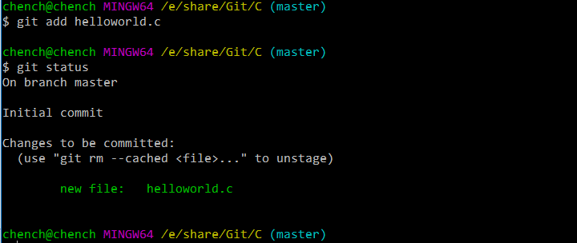

# Git
## 一、系统设置
### 1.全局设置
	
	//设置全局用户
	git config --global user.name "hangcchhn"
	//设置全局邮箱
	git config --global user.email "hangcchhn@163.com"
	//查看设置
	git config --list

## 二、基本操作
### 1.`git init`
初始化工作目录，生成.git隐藏文件夹，创建本地仓库。

	git init

### 2.`git status`
查看文件状态，

	//用vim创建文本文件，编辑helloworld程序
	vim helloworld.c
	git status

### 3.`git add`
跟踪工作目录中的某文件，并将该文件添加暂存区域。
	
	//跟踪helloworld.c，并将其添加到暂存区域
	git add helloworld.c
	git status

### 4.`git commit`
将暂存区域提交到本地仓库。

	//将helloworld.c提交到本地仓库
	git commit -m "commit helloworld.c"
	git status

如果需要修改该文件，那么修改后必须重复上述`git add`和`git commit`操作。

### 5.`git rm`
删除本地仓库的某文件，并删除工作目录中的该文件，

	//删除helloworld.c
	git rm helloworld.c
	ls
	git status

## 三、远程操作

### 1.`git remote`

	//添加远程仓库网址
	git remote add origin https://github.com/chenchanghang/C.git
	//删除远程仓库网址
	git remote remove origin

### 2.`git push`
将本地仓库同步到远程仓库上

	//首次——需要输入用户名和密码
	git push -u origin master
	//重复
	git push

### 3.`git clone`
将远程仓库克隆到本地目录，创建本地仓库。

	git clone https://github.com/chenchanghang/clone.git

