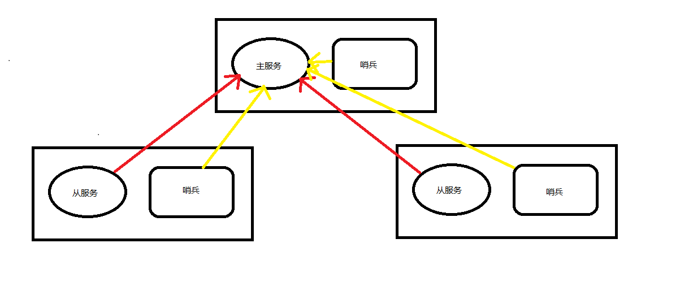

# Centos Redis


## 安装

```
redis-4.0.8.tar.gz

tar -zxvf redis-4.0.8.tar.gz

mv redis-4.0.8 /usr/local/redis

cd /usr/local/redis/src

make|make MALLOC=libc

make install PREFIX=/usr/local/redis|make install PREFIX=/chench/redis-4.0.8

cd /usr/local/redis/bin

cp ../*.conf ./

```

## 配置

### redis.conf

```

bind 0.0.0.0 # 地址

requirepass ****** # 密码

daemonize yes # 开启守护线程

protected-mode no # 禁用保护模式


```

## 启动

### 服务端

`redis-server redis.conf`

### 客户端

`redis-cli -h host -p port -a auth`


## 集群

### 主从复制

### 哨兵模式（Redis Sentinel）

#### start.sh|bat




- 主备服务进程启动脚本：
	- `redis-server redis-port.conf`
- 哨兵服务进程启动脚本：
	`redis-sentinel redis-sentinel-port.conf`
	`redis-server redis-sentinel-port.conf --sentinel`

先启动一个主机服务进程
再启动两个备机服务进程
后启动三个哨兵服务进程

#### redis.conf

```
# 通用配置
bind 0.0.0.0 # 地址

requirepass ****** # 密码

daemonize yes # 开启守护线程

protected-mode no # 禁用保护模式

# 集群配置
port 6379 # 端口

pidfile /var/run/redis-6379.pid # 进程文件

dbfilename dump-6379.rdb # 数据文件

logfile "/var/log/redis-6379.log"

# 主备配置（主机不需备机需要）
slaveof 127.0.0.1 6379 # 主机地址和端口

masterauth ****** # 主机密码


```
#### sentinel.conf


```
protected-mode no # 禁用保护模式

port 26379 # 端口

# sentinel monitor 哨兵监听
# mymaster 主机名称
# 127.0.0.1 主机地址
# 6379 主机端口
# 2 哨兵数量
sentinel monitor mymaster 127.0.0.1 6379 2

# 主机密码：mymaster 主机名称
sentinel auth-pass mymaster ******


```


## 注意

```
# 工作路径
dir ./


# 要配置随时保存缓存数据快照的功能
# 就不能适当的监控和持久化到磁盘上
stop-writes-on-bgsave-error no

```


