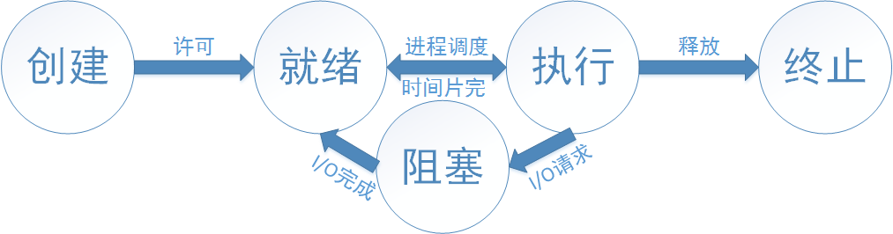
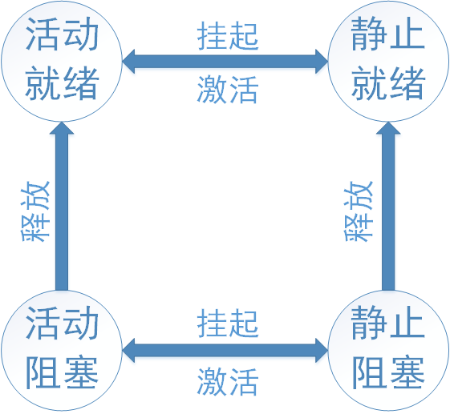

# 中央处理机
> Central Processing Unit

---
## 1.程序
> program

### 程序顺序执行

- 顺序性
- 封闭性
- 可再现性

### 程序并发执行

- 间断性
- 失去封闭性
- 不可再现性

---
## 2.进程
> process

进程由进程控制块、程序段和数据段组成。

进程是系统进行资源分配和调度的一个独立单位。

### 进程特征

- 动态性
- 并发性
- 独立性
- 异步性

### 进程状态

- 创建
- 终止
- 就绪
- 执行
- 阻塞
### 状态变化

### 数据结构

- 内存表
- 设备表
- 文件表
- 进程表

### 进程控制块PCB

- 组织方式
    - 线性方式
    - 链接方式
    - 索引方式

### 3.线程
> thread

### 内核支持线程
> KST(Kernel Supported Threads)

### 用户级线程
> ULT(User Level Threads)

### 组合方式

- 多对一模型
- 一对一模型
- 多对多模型

---

