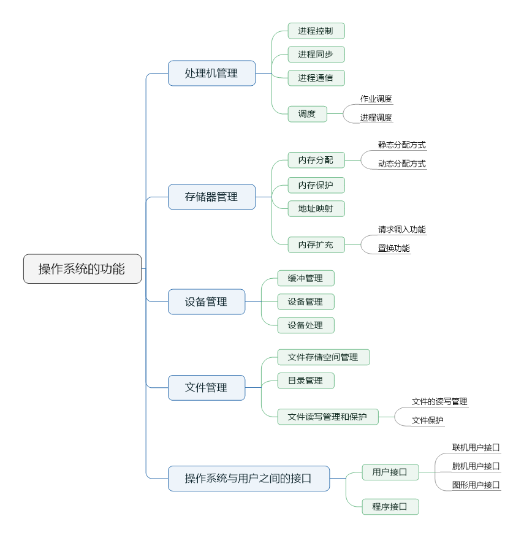

# 操作系统——Operating System

## 1.1 操作系统的引论

### 1.1.1 操作系统的目标

- 方便性
- 有效性
- 可扩充性
- 开放性

### 1.1.2 操作系统的作用

- 操作系统作为用户与计算机硬件系统之间的接口
- 操作系统作为计算机系统资源的管理者
- 操作系统实现了计算机资源的抽象

## 1.2 操作系统分类

### 1.2.1 多道批处理系统

### 1.2.2 分时系统

#### 1.分时系统的定义

分时系统是指在一台主机上连接了多个配有显示器和键盘的终端并由此所组成的系统，该系统允许多个用户同时通过自己的终端，一交互方式使用计算机，共享主机中的资源。

### 1.2.3 实时系统

#### 1.实时系统的定义

实时系统是指系统能及时响应外部事件的请求，在规定的时间内完成对该事件的处理，并控制所有的实时任务协调一致地运行。

### 1.2.4 单用户多任务操作系统——Windows

### 1.2.5 多用户多任务操作系统——Unix

## 1.3 操作系统的特征

操作系统的最基本特征是并发和共享。

### 1.3.1 并发

- 并行性是指两个或多个事件在同一时刻发生

- 并发性是指两个或多个事件在同一时间间隔内发生

### 1.3.2 共享

### 1.3.3 虚拟

在操作系统中，把通过某种技术将一个物理实体变为若干个逻辑上的对应物的功能称为虚拟。

### 1.3.4 异步

## 1.4 操作系统的功能

## 1.5 操作系统结构

### 1.5.1 无结构操作系统

### 1.5.2 模块化结构操作系统

### 1.5.3 分层式结构操作系统

### 1.5.4 微内核结构操作系统

- 足够小的内核
- 基于客户/服务器模式
- 应用“机制与策略分离”原理
- 采用面向对象技术

