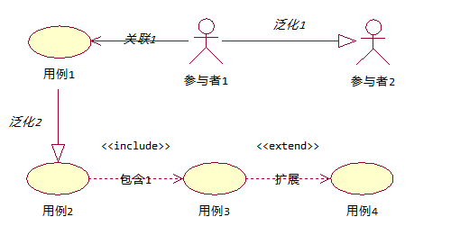
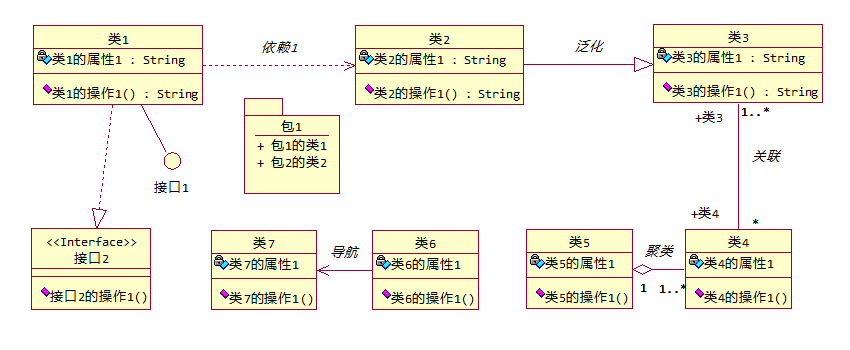

# UML
> 统一建模语言UML

- Ration Rose
    - IBM

- PowerDesigner
    - sybase:数据库建模

- StarUML
    - 韩国

- Visio
    - 微软

## 一、用例图
### 1.参与者（Actor）
用人形图标表示
### 2.用例（Use Case）
用椭圆表示

### 3.关系
#### (1) 参与者之间的关系
- 泛化：用带有空心箭头的实线来表示。
#### (2) 用例之间的关系
- 泛化：用带有空心箭头的实线来表示。
- 包含：用带有箭头的虚线和&laquo;include&raquo;字样来表示。
- 拓展：用带有箭头的虚线和&laquo;extend&raquo;字样来表示。
#### (3) 参与者与用例之间的关系
- 关联：用带有箭头的实线来表示。

## 二、类图
### 1.类
用矩形来表示

- 属性：
- 操作：

### 2.接口
用圆圈来表示

### 3.关系
#### (1) 类之间的关系

- 依赖：用带有箭头的虚线来表示。
- 泛化：用带有空心箭头的实线来表示。
- 关联：用实线来表示。

#### (2)类与接口之间的关系
- 实现：用实线来表示或用带有空心箭头的虚线来表示。

## 三、对象图

## 四、时序图
### 1.对象

- 用矩形来表示

### 2.生命线

- 用垂直的虚线来表示

### 3.激活条

- 用矩形来表示

### 4.消息

## 五、协作图
### 1.对象

### 2.链

### 3.消息

## 六、状态图

### 1.开始和结束状态

### 2.中间状态

### 3.状态之间的转换

### 4.状态的子转换

## 七、活动图

## 八、组件图

### 1.组件

### 2.关系

## 九、配置图

