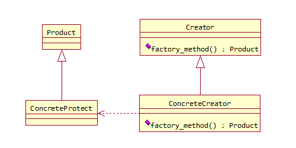
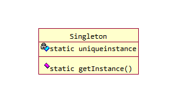

# 设计模式
> design patterns

## 设计原则
- 针对接口编程，而不是针对实现编程。

- 多用组合，少用继承。

-  开放关闭原则
    - 类应该对扩展开放，对修改关闭。

- 依赖倒置原则
    - 要依赖抽象，不要依赖具体类。

## 工厂方法模式
> Factory Method Pattern

- 工厂方法
工厂方法用来处理对象的创建，并将这样的行为封装在子类中。

```java
class Factory{
    public abstract Product factory_method(String type);
}
```

- 工厂方法模式
工厂方法模式定义了一个创建对象的接口，工厂方法让类把实例化推迟到子类。


## 2.单例模式——Singleton Pattern

- 单例模式
单件模式确保一个类只有一个实例，并提供一个全局访问点。




