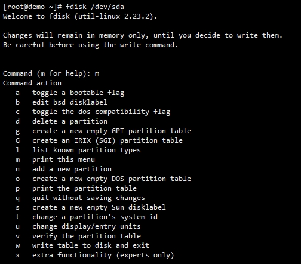
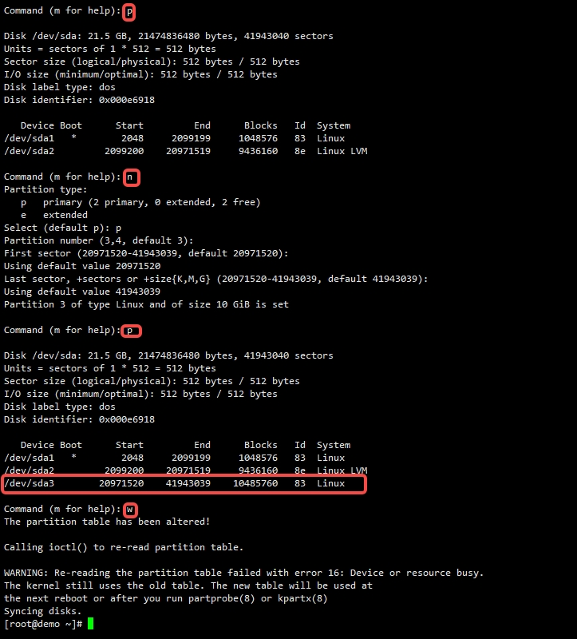
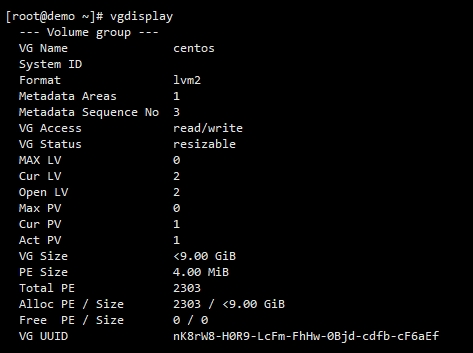
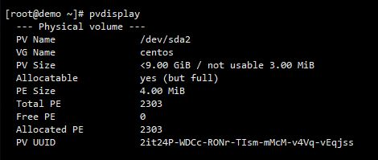
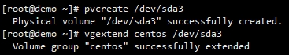
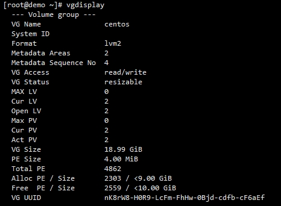
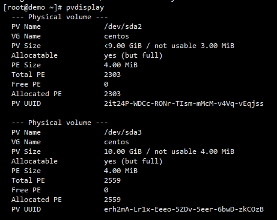
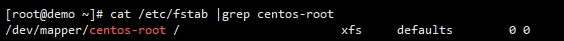
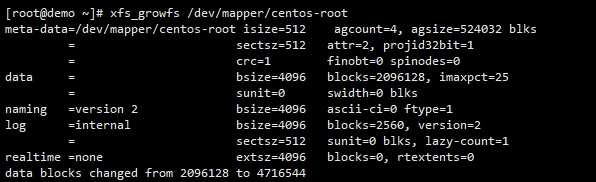

# 磁盘扩容
> disk extend

- CentOS 7.x
- VMware 10G

---

- `fdisk /dev/sda`

- `p -> n -> p -> enter -> enter -> enter -> p -> w`

- `reboot`

---

- `pvcreate /dev/sda3`
- `vgextend centos /dev/sda3`

- PV(Physical Volume)
- VG(Volume Group)

---

- `lvextend -l+2559 /dev/mapper/centos-root`

---
- 查看文件系统格式:`cat /etc/fstab | grep centos-root`

- CentOS 7.x:`xfs_growfs /dev/mapper/centos-root`

- CentOS 6.x:`resize2fs /dev/mapper/centos-root`

