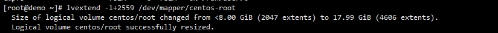

# 磁盘扩容
>

- CentOS 7.x
- VMware 10G

---

- `fdisk /dev/sda`

- `p -> n -> enter -> enter -> p -> w`

---

-
- `pvcreate /dev/sda3`
- `vgextend centos /dev/sda3`

- PV(Physical Volume)
- VG(Volume Group)

---

- `Free  PE / Size       2559 / <10.00 GiB`
- `lvextend -l+2559 /dev/mapper/centos-root`

---
- 文件系统格式

- xfs_growfs /dev/mapper/centos-root

`
- CentOS 6.x:`resize2fs /dev/mapper/centos-root`

