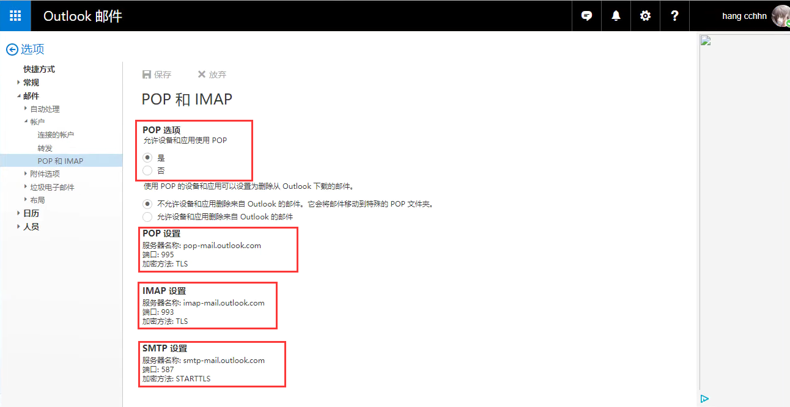
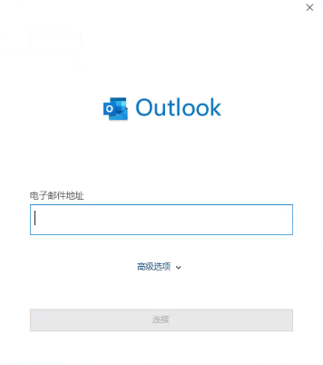
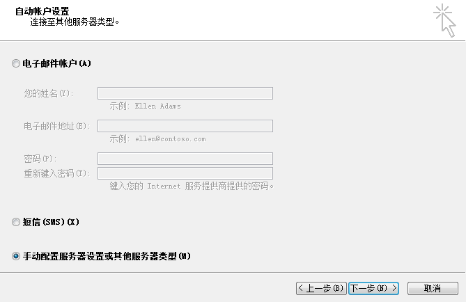
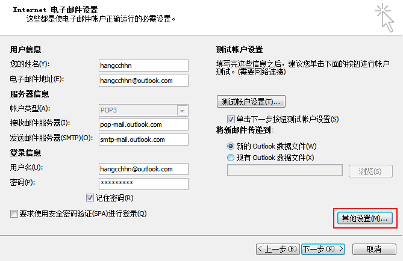
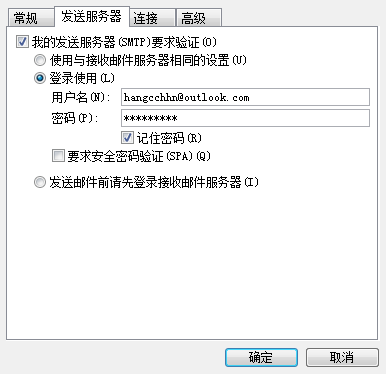
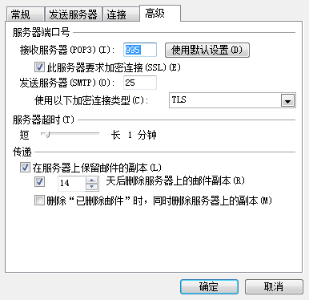
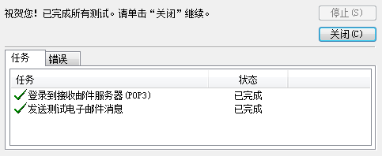

# Outlook

> Microsoft Office Outlook

## 一、Outlook_web
以下操作的前提是拥有一个Outlook邮箱

接着在浏览器中登录网页版Outlook邮箱
访问[https://outlook.live.com/owa/?path=/options/popandimap](https://outlook.live.com/owa/?path=/options/popandimap "POP和IMAP设置")网址设置POP和IMAP

## 二、Outlook2016
使用Office2016会自动安装Outlook2016

安装好后直接启动程序弹出登录邮箱窗口

此版本使用相当简单在此简述步骤和过程

## 三、Outlook2010

安装Office2010时可以选择安装组件Outlook2010

### 1.启动程序手动配置

### 2.填写电子邮箱参数
- pop-mail.outlook.com
- smtp-mail.outlook.com

### 3.其他设置（发送服务器和高级）

### 4.测试账户设置

