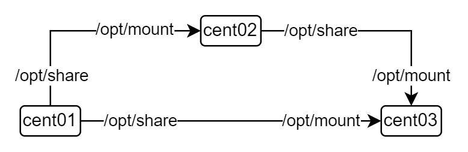

# NFS
> Network File System


## CentOS

- server:
    - cent01:192.168.10.201:/opt/share
    - cent02:192.168.10.202:/opt/share
- client:
    - cent02:192.168.10.202:/opt/mount
    - cent03:192.168.10.203:/opt/mount




---
- 关闭防火墙:`systemctl stop firewalld`
    - portmapper:111
    - nlockmgr:39493
    - nfs:2049
    - mount:20048

```

firewall-cmd --add-service=mountd --zone=public --permanent
firewall-cmd --add-service=rpc-bind --zone=public --permanent
firewall-cmd --add-service=nfs --zone=public --permanent
firewall-cmd –reload
```

---
- 服务端
```sh

yum install -y rpcbind
yum install -y nfs-utils

systemctl start rpcbind
systemctl start nfs

systemctl enable rpcbind
systemctl enable nfs

mkdir -p /opt/share
chmod -R 777 /opt/share

vim /etc/exports
# /share *(rw)
exportfs -rv

systemctl restart rpcbind
systemctl restart nfs


rpcinfo -p cent01
#    program vers proto   port  service


```
---
- /etc/exports
```
/opt/share cent02(rw,sync,insecure,all_squash) cent03(rw,sync,insecure,all_squash)
```
- ro:只读
- rw:读写

- sync
- async

- all_squash:匿名nfsnobody用户
- no_all_squash

- anonuid:匿名用户id
- anongid:匿名用户组id


---
## 客户端

```sh
yum install -y nfs-utils

showmount -e cent01

# 临时挂载
mount -t nfs cent01:/opt/share /opt/mount

# 永久挂载
vim /etc/fstab
mount -a
# cent01:/opt/share ??? /opt/mount

```
---
- /etc/fstab
```
cent01:/opt/share /opt/mount nfs defaults,_netdev 0 0
cent02:/opt/share /opt/mount nfs defaults,_netdev 0 0
```
- _netdev:当系统联网后再进行挂载操作

---

```sh

# cent01
touch /opt/share/cent01.txt
# cent02
ls -la /opt/mount
# -rw-r--r--. 1 root root ??? cent01.txt

# cent02
touch /opt/mount/cent02.txt
# cent01
ls -la /opt/share

```


---